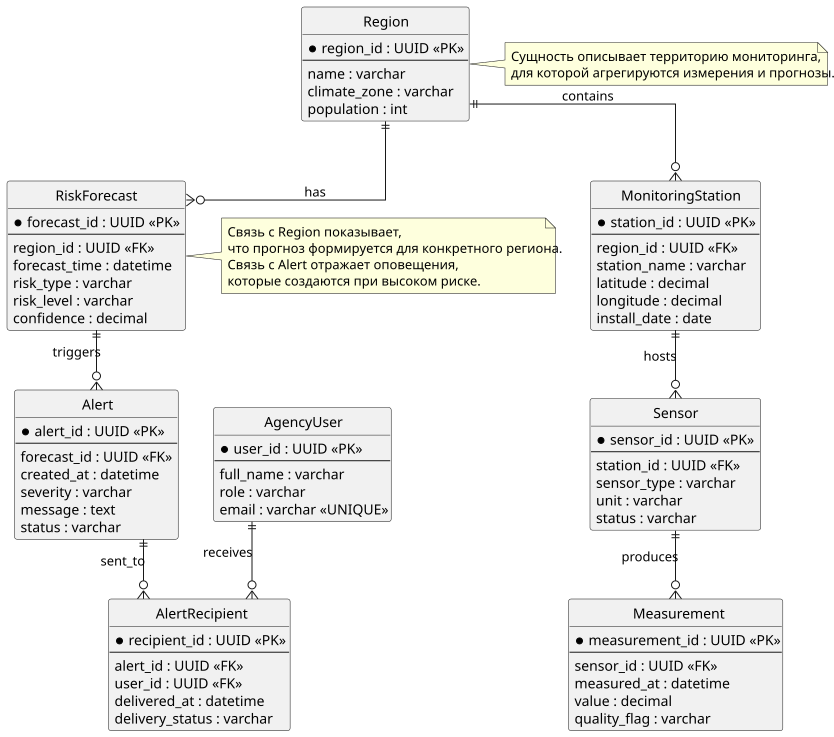
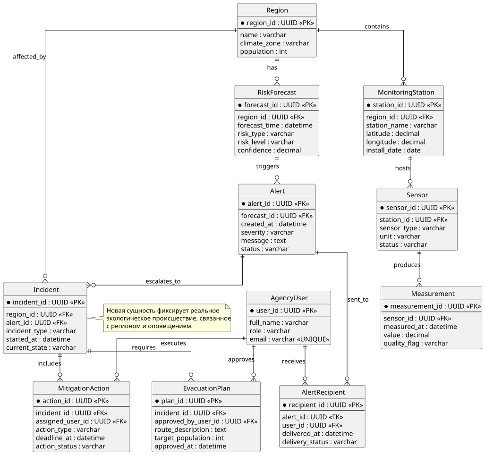

# Отчет по лабораторной работе 2

## Цель работы
Освоить применение большой языковой модели (БЯМ) и PlantUML для генерации ER-диаграммы реляционной базы данных информационной системы на примере варианта №2 (EcoGuardian), а также выполнить критическую оценку результата и ручное расширение модели данных.

## Постановка задачи
Необходимо составить промпт к БЯМ для генерации PlantUML-скрипта ER-диаграммы, соответствующей предметной области EcoGuardian (интеллектуальный мониторинг экологической обстановки и рисков). Затем требуется:
- получить и визуализировать исходную диаграмму;
- интерпретировать (оценить) ответ БЯМ;
- вручную дополнить диаграмму 2-3 сущностями и связями с нотацией "вороньи лапки";
- записать отношения для двух связей (по одному утверждению для каждой стороны связи).

## Промпт для генерации скрипта
```text
Сгенерируй PlantUML-скрипт ER-диаграммы (crow's foot) для реляционной базы данных
информационной системы EcoGuardian.

Контекст предметной области:
- система мониторит экологическую обстановку в регионах в реальном времени;
- получает данные со станций/датчиков;
- сохраняет измерения;
- строит прогнозы экологических рисков;
- формирует оповещения для ответственных служб.

Требования к диаграмме:
1) Используй сущности с атрибутами и пометками PK/FK.
2) Отрази кардинальности в стиле "вороньи лапки" (one-to-many, optionality где уместно).
3) Включи не менее 7 сущностей, включая сущности для региона, станции, датчика,
   измерения, прогноза риска, оповещения и получателя оповещения.
4) Добавь краткое текстовое описание:
   - назначения каждой сущности;
   - ключевых связей между сущностями.
5) Выведи ответ в двух частях:
   A) готовый PlantUML-код;
   B) пояснение по сущностям и связям.
```

## Полученный скрипт
Скрипт, полученный на основе указанного промпта, сохранен в файле `er_base.puml`.

## Диаграмма (визуализация скрипта в Plant UML)
Визуализация исходной диаграммы:


## Описание диаграммы
В исходной модели отражен основной жизненный цикл данных EcoGuardian:
- `Region` задает территорию мониторинга;
- `MonitoringStation` описывает инфраструктуру наблюдения в регионе;
- `Sensor` задает конкретные измерительные устройства;
- `Measurement` хранит поток фактических наблюдений;
- `RiskForecast` хранит результаты прогноза риска по региону;
- `Alert` фиксирует оповещения, сформированные по прогнозам;
- `AgencyUser` и `AlertRecipient` моделируют доставку оповещений ответственным пользователям.

Ключевые связи:
- один регион содержит много станций;
- одна станция содержит много датчиков;
- один датчик формирует много измерений;
- один регион имеет много прогнозов;
- один прогноз может породить много оповещений;
- одно оповещение рассылается многим пользователям через таблицу-связку `AlertRecipient`.

## Оценка (интерпретация) ответа БЯМ
Сильные стороны ответа:
- логичная и непротиворечивая декомпозиция на сущности операционного контура мониторинга;
- корректное выделение сущности-связки (`AlertRecipient`) для разрешения связи многие-ко-многим;
- наличие PK/FK и пригодность схемы к реализации в реляционной СУБД.

Ограничения и замечания:
- исходная модель ориентирована в основном на мониторинг и оповещения, но слабо покрывает фазу реагирования на уже случившиеся инциденты;
- не выделены сущности оперативного плана действий;
- часть доменных атрибутов можно нормализовать (например, справочники типов рисков/статусов).

Вывод по интерпретации:
Ответ БЯМ можно считать качественной базовой схемой, пригодной как стартовый вариант. Для полноты варианта EcoGuardian схема требует ручного расширения подсистемы реагирования.

## Описание дополнения диаграммы двумя-тремя сущностями
Вручную добавлены 3 сущности:
- `Incident` — факт экологического происшествия, связанный с регионом и оповещением;
- `EvacuationPlan` — план эвакуации для конкретного инцидента;
- `MitigationAction` — набор мер по снижению последствий инцидента.

Добавленные связи:
- `Region` 1:N `Incident`;
- `Alert` 1:N `Incident`;
- `Incident` 1:N `EvacuationPlan`;
- `Incident` 1:N `MitigationAction`;
- `AgencyUser` 1:N `EvacuationPlan` (утверждает план);
- `AgencyUser` 1:N `MitigationAction` (исполняет мероприятие).

## Обновленная диаграмма
Обновленный скрипт сохранен в `er_updated.puml`.

Визуализация обновленной диаграммы:


## Записанные отношения для двух связей
### Связь 1: `MonitoringStation` — `Sensor` (1:N)
1) «Одна станция мониторинга содержит один или несколько датчиков».  
2) «Каждый датчик относится только к одной станции мониторинга».

### Связь 2: `Incident` — `MitigationAction` (1:N)
1) «Один инцидент включает одно или несколько мероприятий по реагированию».  
2) «Каждое мероприятие по реагированию относится только к одному инциденту».

## Рефлективное заключение
В ходе работы подтверждено, что БЯМ ускоряет проектирование ER-модели на этапе чернового варианта и снижает порог входа в формализацию предметной области. При этом итоговое качество зависит от точности промпта и обязательной экспертной валидации. Наиболее эффективный подход — комбинация автоматической генерации и ручной доработки семантически критичных фрагментов (в данном случае блока оперативного реагирования).
